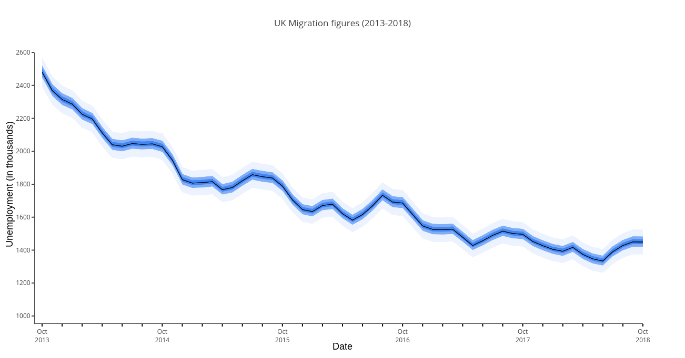
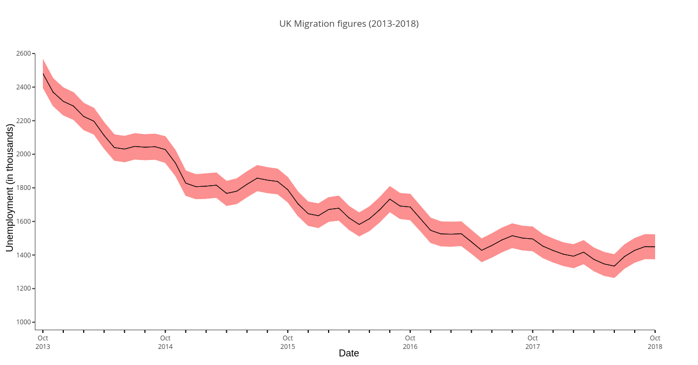
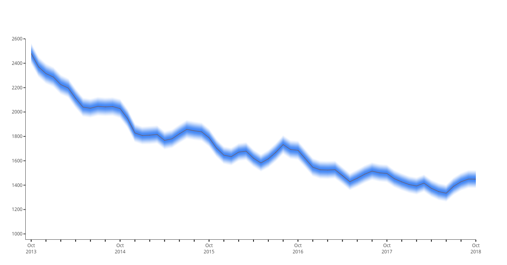
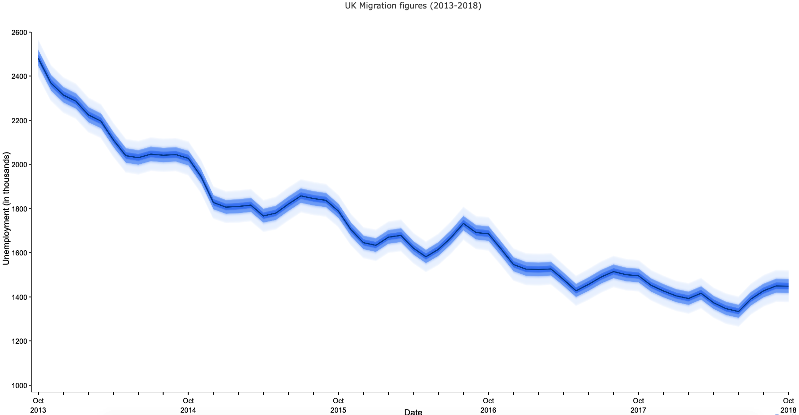
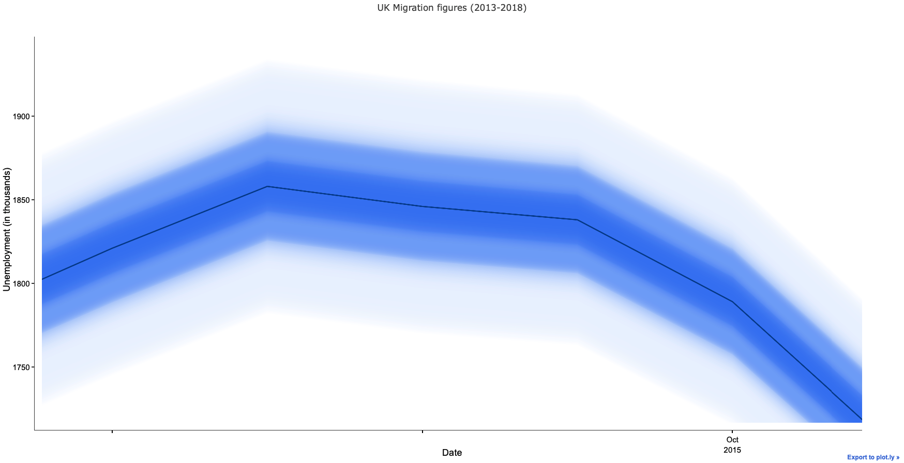

# Uncertainty Plots with python and plotly.
Fan charts and their variations explored by the Winton Centre for Risk and Evidence Communication. Similar to fan chart by Office for National Statistics. Take a look at [jupyter notebook examples](examples/unemployment_example.html) to see the usage.

Solid fan chart example


Standard error chart example


Density chart example


Fuzzy fan chart example


Fuzzy fan - Zoomed



## Prerequisites
Python 3.4+

## Usage and Examples - Jupyter Notebook
Best way to see usage are [jupyter notebook examples](examples/unemployment_example.html).

Local copy can also be run which allows modification.
In terminal:
```
pip install jupyter

jupyter notebook
``` 

## Getting started

### (Optional) - Create virtual environment.
_1. Go to project directory_

_2. Create a virtual environment_

In terminal: 
`python3 -m venv .venv`

_3. Activate virtual environment_

In terminal: 
`. .venv/bin/activate`


### Installation

Install module using pip.
In terminal type: `pip install .`
 
 (TODO FUTURE: `pip install fuzzyplots`)

### Usage

#### Basic Plot

Create a python with the code below.
Provide your own values to plot to parameter.
```
# Import the module
from fuzzy.core import FanPlotly

solid_ci = FanPlotly(
    x, y_median,
    ci95p=y_p_95, ci95n=y_n_95,
    ci60p=y_p_60, ci60n=y_n_60,
    ci30p=y_p_30, ci30n=y_n_30,
)

# Plot
solid_ci.plot()

```
In terminal execute the file.

## Classes

### Solid Fan chart
`FanPlotly(x, y, ci95p, ci95n, ci60p, ci60n, ci30p, ci30n, fuzz_size, fuzz_n, color='#4286f4', median_line=True, median_line_color='#000000', median_line_width=1, layout={'showlegend': False}, figs=[], output='auto')`

Required parameters:
- x: x-axis values in a list.
- y: y-axis median values in a list.
- ci95p: Upper values of 95% confidence interval in a list.
- ci95n: Lower values of 95% confidence interval in a list.
- ci60p: Upper values of 60% confidence interval in a list.
- ci60n: Lower values of 60% confidence interval in a list.
- ci30p: Upper values of 30% confidence interval in a list.
- ci30n: Lower values of 30% confidence interval in a list.
- fuzz_size: The width of the blurring. Takes integer value between 0-1.
- fuzz_n: The number of colour levels used to implement the blur. Takes integer value between 0-150.

### Density chart

`DensPlotly(x, y, ci95p, ci95n, fuzz_n, color='#4286f4', median_line=True, median_line_color='#000000', median_line_width=1, layout={'showlegend': False}, figs=[], output='auto')`

Required parameters:
- x: x-axis values in a list.
- y: y-axis median values in a list.
- ci95p: Upper values of 95% confidence interval in a list.
- ci95n: Lower values of 95% confidence interval in a list.

### Standard error chart

`StandardErrorPlot(x, y, ci95p, ci95n, fuzz_n, color='#4286f4', median_line=True, median_line_color='#000000', median_line_width=1, layout={'showlegend': False}, figs=[], output='auto')`

Required parameters:
- x: x-axis values in a list.
- y: y-axis median values in a list.
- ci95p: Upper values of 95% confidence interval in a list.
- ci95n: Lower values of 95% confidence interval in a list.
- fuzz_n: The number of colour levels used to implement the blur. Takes integer value between 0-150.


### Fuzzy fan chart
`FuzzyPlotly(x, y, ci95p, ci95n, ci60p, ci60n, ci30p, ci30n, fuzz_size, fuzz_n, color='#4286f4', median_line=True, median_line_color='#000000', median_line_width=1, layout={'showlegend': False}, figs=[], output='auto')`

Required parameters:
- x: x-axis values in a list.
- y: y-axis median values in a list.
- ci95p: Upper values of 95% confidence interval in a list.
- ci95n: Lower values of 95% confidence interval in a list.
- ci60p: Upper values of 60% confidence interval in a list.
- ci60n: Lower values of 60% confidence interval in a list.
- ci30p: Upper values of 30% confidence interval in a list.
- ci30n: Lower values of 30% confidence interval in a list.
- fuzz_size: The width of the blurring. Takes integer value between 0-1.
- fuzz_n: The number of colour levels used to implement the blur. Takes integer value between 0-150.

### Shared optional parameters.

- color: Colour of fans/confidence interval. Takes in a hex value in string. Default value is #4286f4. Automatically determines colour based on confidence interval area.
- layout: [Plotly layout](https://plot.ly/python/reference/#layout) object to configure layout of chart.
- median_line: True/False to enable or disable median line. Default value is True.
- median_line_color: Colour of median line. Takes in a hex value in string. Default value is #000000.
- median_line_width: Thickness of median line. Takes in integer. Default value is 1.
- figs: Takes in plotly data structures to add additional charts. Pass in as a list if there are multiple figures to plot.


## Other Options

### Plotting options
FuzzyPlotly supports offline, online and jupyter notebook. It automatically defaults to offline mode and detect running of jupyter notebook (ipython).

Possible parameters for output are "auto", "offline", "online", "jupyter"

##### Auto
"auto" is is the value used when output parameter isn't given by an user.
FuzzyPlot will try to figure out user's running environment and automatically pick best setting.

`dens_plot = DensPlotly(x=x, y=y_median, ci95p=y_p_95, ci95n=y_n_95, fuzz_n=30)`

##### Offline
By default this mode will be used unless it is being run inside of jupyter notebook.
If output="offline" is set within jupyter html page with plot will be generated and opened.

`dens_plot = DensPlotly(x=x, y=y_median, ci95p=y_p_95, ci95n=y_n_95, fuzz_n=30, output='offline')`

##### Jupyter Notebook
User shouldn't need to pass this value. Passing jupyter will force FuzzyPlotly to use plot option for jupyter notebook.

`dens_plot = DensPlotly(x=x, y=y_median, ci95p=y_p_95, ci95n=y_n_95, fuzz_n=30, output='jupyter')`

##### Online
To use online mode please add your username/api key from plot.ly at start and run the code.

`plotly.tools.set_credentials_file(username='jack89', api_key='qwfw32EW3twqkitdf')`

`dens_plot = DensPlotly(x=x, y=y_median, ci95p=y_p_95, ci95n=y_n_95, fuzz_n=30, output='online')`

(Refer to plotly documentation for addition information.
 https://plot.ly/python/configuration-options/
)

### Axis
#### Date time


(TODO: There was more python related site???)
Use dateutil module to convert to plotly friendly format. 
https://help.plot.ly/date-format-and-time-series/

Please refer to https://stackabuse.com/converting-strings-to-datetime-in-python/

```
from dateutil.parser import parse

date_array = [  
    '2018-06-29 08:15:27.243860',
    'Jun 28 2018  7:40AM',
    'Jun 28 2018 at 7:40AM',
    'September 18, 2017, 22:19:55',
    'Sun, 05/12/1999, 12:30PM',
    'Mon, 21 March, 2015',
    '2018-03-12T10:12:45Z',
    '2018-06-29 17:08:00.586525+00:00',
    '2018-06-29 17:08:00.586525+05:00',
    'Tuesday , 6th September, 2017 at 4:30pm'
]

for date in date_array:  
    print('Parsing: ' + date)
    dt = parse(date)
    print(dt.date())
    print(dt.time())
    print(dt.tzinfo)
    print('\n')
```
Output: 
```
$ python3 dateutil-1.py
Parsing: 2018-06-29 08:15:27.243860  
2018-06-29  
08:15:27.243860  
None

Parsing: Jun 28 2018  7:40AM  
2018-06-28  
07:40:00  
None

Parsing: Jun 28 2018 at 7:40AM  
2018-06-28  
07:40:00  
None

Parsing: September 18, 2017, 22:19:55  
2017-09-18  
22:19:55  
None

Parsing: Sun, 05/12/1999, 12:30PM  
1999-05-12  
12:30:00  
None

Parsing: Mon, 21 March, 2015  
2015-03-21  
00:00:00  
None

Parsing: 2018-03-12T10:12:45Z  
2018-03-12  
10:12:45  
tzutc()

Parsing: 2018-06-29 17:08:00.586525+00:00  
2018-06-29  
17:08:00.586525  
tzutc()

Parsing: 2018-06-29 17:08:00.586525+05:00  
2018-06-29  
17:08:00.586525  
tzoffset(None, 18000)

Parsing: Tuesday , 6th September, 2017 at 4:30pm  
2017-09-06  
16:30:00  
None  
```

## Labeling
Pass in plotly layout to customize figure including labels.


```
# Create layout
layout = go.Layout(
    title='Unemployment between 2012 and 2017',
    xaxis=dict(
        title='Dates',
        titlefont=dict(
            family='Courier New, monospace',
            size=18,
            color='#7f7f7f'
        )
    ),
    yaxis=dict(
        title='Unemployment rate',
        titlefont=dict(
            family='Courier New, monospace',
            size=18,
            color='#7f7f7f'
        )
    )
)

FuzzyPlotly(x_sample_values, y_sample_values, std, layout=layout).plot()

```
